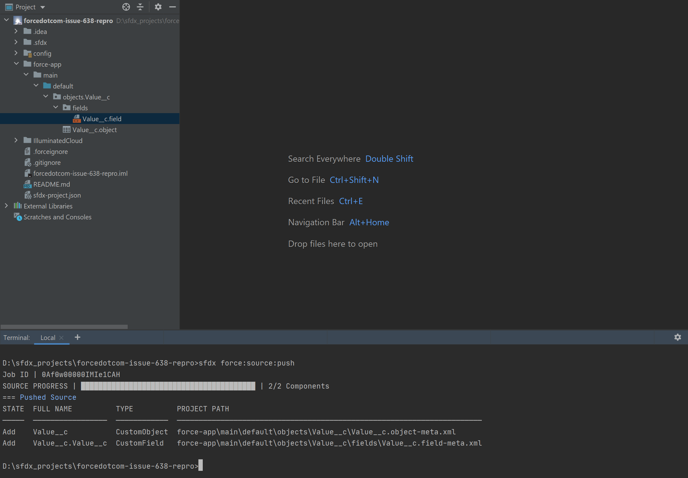
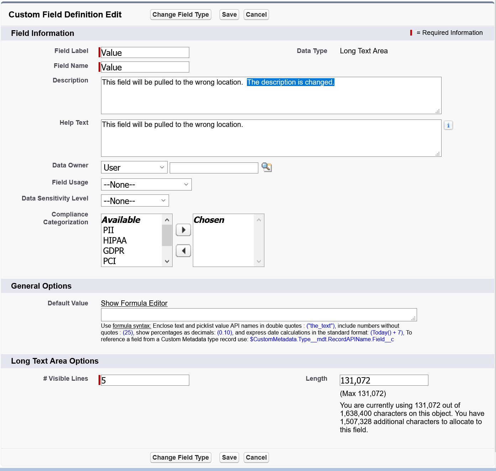
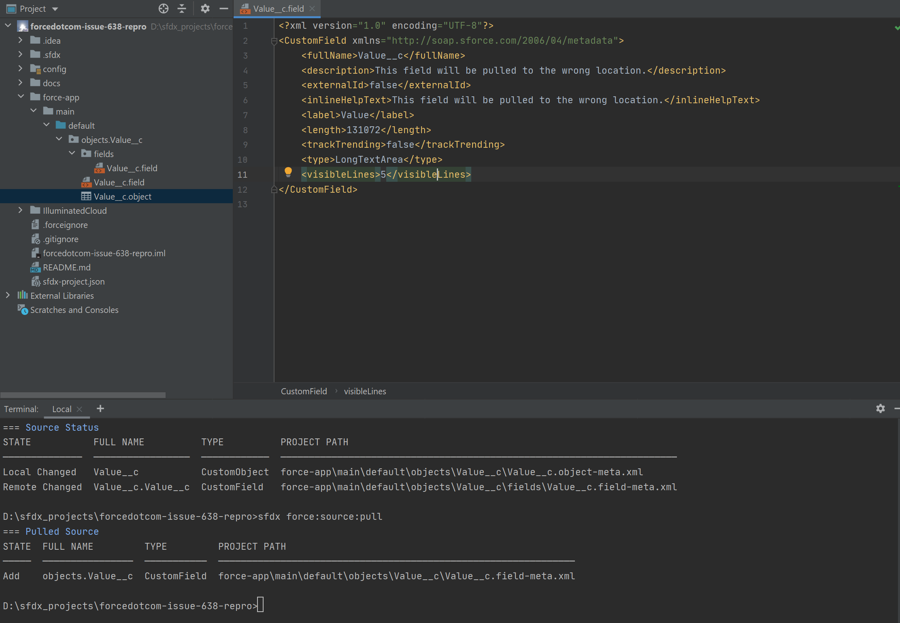

# This is a reproduction of forcedotcom CLI issue 638

See https://github.com/forcedotcom/cli/issues/638.

## Reproduction Details
1. Create a new scratch org using the scratch org definition file contained within this repository.

2. Push the source (this repo) to the new scratch org:

3. Log in to the scratch org and edit the `Value__c` field on the `Value__c` object.

4. Pull the source back from your scratch org:

As you can see above, the `Value__c` field has been pulled to the incorrect location.
